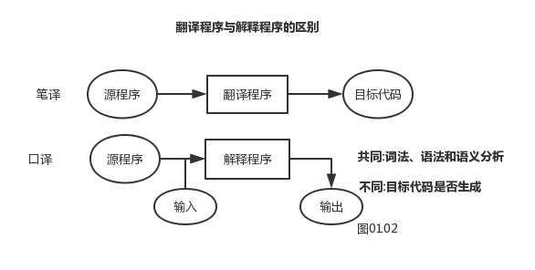

# 引论

`第一周-周二-56节`

- 课程内容:`平时测试-60-每周`+`实验20`+`项目20-词法+语法+指导书`
  - 编译程序实现的原理和技术 => 写一个编译器（五部分组成）
  - 编译原理试题 => [OJ试题](acm.sdut.edu.cn)
- 书目推荐:`《程序设计...》陈火旺`、`《自己动手构造编译系统》`、`《龙书：编译原理》`

- 使用工具:`理论`+`实践` 、`作业`+`实验`

  - Lex => 词法分析
  - Yacc => 语法分析
  - 层次结构:`词法分析`、`语法分析`、`优化`、`目标代码`、`表格管理与出错处理`

  
插入图0101（processon.com）

- 翻译程序和目标程序

  > 区别:目标程序是否生成

  

----

**其他**:

1. Java既有编译又有解释（字节码）

2. 层次结构：`裸机`->`操作系统`->`语言处理系统(包含编译程序)`->`应用软件层`

3. .语言过程 .obj目标文件 

   | 高级语言(经过编译程序)            | 汇编语言                     | 机器语言  |
   | --------------------------------- | ---------------------------- | --------- |
   | .c(C语言) .PAS(PASCAL源程序*文件) | .ASM(是汇编语言的源程序文件) | .exe .obj |
   | x = A + B                         | ADD AX BX                    | 0和1构成  |

4. 语言程序-中间程序-目标代码

5. 高级语言->编译->低级语言

6. 编译程序分为：

   1. `诊断型`
   2. `优化型`
   3. ``交叉型`：产生不同于宿主机的目标机机器代码

7. 可变目标型编译程序？？？

---

`第一周-周三-78节`

- 为语言的语法描述寻求工具-文法

  - C语言字母表={ 所有C语言基本字符 }
  - C语言 = 符合C语言语法规则的符号串
  - 集合{所有C语言基本字符}*的子集

- 字母表-基本字符集合

- 语法树（练习了如何画语法树）

  
插入图片(作业内容，语法树)

  
插入图片(processon错题样例)

- G=( { i,+,*,(,) } , { E }, E, P )

  - G 文法符号
  - { i, +, *, (, ) } 终结符号 集合Vt
  - { E }  非终结符 集合 Vn
  - E 开始符号
  - P 产生式 集合 P

- a0+=>an 经过一步或多步推导  a0=an 不可以
- an*=>an 经过零步或多步推导 a0=an 可以 
- 句型和句子生成举例
  - =》 几个 就是几次产生式
  - 句型 ( VtUVn )*
  - 句子 (Vt)*
- 一般遵循最左推导

---

**其他**

1. {a,b}* 闭包
2. 终结符只在程序中出现
3. "->"定义为 用于定义规则
4. "=>"推导符号
5. 直接推导：一次推导就推导完成 ？？？
6. 左递归？？只在左边出现？？
7. a。=> a1=>a2=>....=>an 从a0到an的一个推导 序列？
8. 推导 归约

---

`第一周-周四-34节`

- L(G)={ a | s+=>a & a is Vt* }  语言

- G[E]: E->E+E | E*E | ( E ) | i  产生式集合？

- S->bA A->a

- S=>bA=>ba

- 最左推导 一次一个 推导出一种 

- 四种文法

  - 上下无关文法组成
